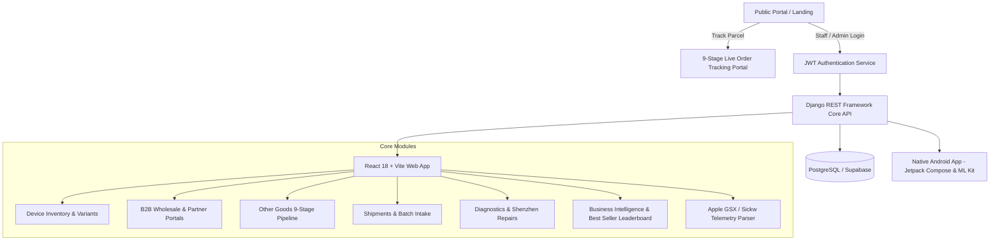

# 📱 Gadget Deluxe — Enterprise IMEI Inventory, Sourcing & Tracking Ecosystem

<div align="center">


**Next-Gen Cross-Border Electronics Procurement, Hardware Refurbishment, 9-Stage Live Parcel Tracking & Multi-Channel B2B Wholesale Management System.**

[🌐 Public Portal & Tracking](https://gadgetdeluxe.store) • [📦 Track Orders](https://gadgetdeluxe.store/track) • [📊 Admin Workspace](https://gadgetdeluxe.store/login) • [📂 GitHub Repository](https://github.com/jubaerkhan49/gadget-deluxe)

</div>

---

## 🌟 Overview

**Gadget Deluxe** is an all-in-one cloud inventory, sourcing, and logistics operations platform tailored for modern consumer electronics enterprises. Built specifically for high-turnover cross-border electronics trade (e.g., Shenzhen/Hong Kong/USA $\to$ Bangladesh), hardware refurbishing pipelines, team sales commissions, custom single-item import orders, and Business-to-Business (B2B) client networks.



---

## 🚀 Key Modules & Capabilities

### 1. 📱 Device Inventory & IMEI Lifecycle Management
- **Universal Identifier Indexing**: Instant search by primary IMEI, secondary IMEI2, Serial Number (SN), MEID, or Model.
- **Hardware Telemetry & Battery Health**: Comprehensive tracking of battery health %, cycle counts, display types, Face ID / True Tone status, and original hardware components.
- **Dynamic Country & Variant Filtering**: Built-in indexing for international device variants (`Modified`, `USA eSim`, `Canada`, `Mexican`, `Korea`, `Singapore`, `Bypass`).
- **Physical Custody Audit Log**: Real-time ownership assignment with time tracking (days in possession) to prevent stock stagnation.

### 2. 📦 "Other Goods" & Custom Order Pipeline (9-Stage Live Tracking)
Manage single-item import purchases (Laptops, AirPods, laptop screens, cosmetics, gadgets) with complete customer transparency:
1. **Order Confirmed** (`ORDER_CONFIRMED`)
2. **Payment Made / Advance Paid** (`PAYMENT_RECEIVED`)
3. **Product Purchased** (`PRODUCT_PURCHASED`)
4. **Shipped to CN Warehouse** (`SHIPPED_TO_CN_WAREHOUSE`)
5. **Received at CN Warehouse** (`RECEIVED_AT_CN_WAREHOUSE`)
6. **Shipped to BD (In Transit)** (`SHIPPED_TO_BD`)
7. **Arrived at BD Customs** (`ARRIVED_AT_BD`)
8. **Received in BD Local Hub** (`RECEIVED_IN_BD`)
9. **Product Delivered** (`DELIVERED`)

* **Customer Tracking Portal (`/track`)**: Public-facing, responsive tracking with confidential pricing logic ($\text{Product Price} = \text{Total Amount} - \text{Logistics Cost}$).
* **Multi-Channel Payment Logging**: Support for `bKash`, `Nagad`, `Bank Transfer`, and `Cash` with unique `TrxID` logging.

### 3. 🏬 B2B Client Orders & Wholesale Network
- **Capital Isolation**: Client-funded lots (`is_b2b=True`) are automatically isolated from the owner's personal capital investment metrics.
- **Client-Safe Mode**: Dedicated interface that safeguards internal wholesale margins and purchasing origins when viewed alongside B2B clients.
- **Repair Round-Trip**: Seamless workflow to route defective B2B devices to repair centers and return them directly to the client's inventory lot.

### 4. 🚢 Inbound Shipments & Daily Batch Intake
- **Batch Logistics**: Multi-device intake from global freight forwarding agents with automatic unit shipping cost distribution ($\text{Net Shipping} / \text{Devices Count}$).
- **Active vs. Archived Shipments**: Automatic archival of completed shipment batches once all units arrive in Bangladesh stock.
- **Daily BD Received Reports**: One-click generation of receipt summaries for local logistics verification.

### 5. 🛠️ Hardware Diagnostics & Shenzhen Lab Tracker
- **Shenzhen Round-Trip Logging**: Track repair costs, issues, sent dates, and returned dates.
- **Profit Margin Protection**: Accurately accounts for repair expenditures against final selling margins.

### 6. 📊 Analytics, ROI & Best Seller Leaderboard
- **Consolidated Monthly ROI**:
  $$\text{Net Profit} = \text{Retail Profit} + \text{B2B Profit} - \sum \text{Repair Costs} - \sum \text{Shipping Costs}$$
  $$\text{ROI \%} = \left( \frac{\text{Net Profit}}{\text{Total Self-Invested Capital}} \right) \times 100$$
- **Seller Performance Scoring**: Tracks sales rep volume, profit generation, turnaround speed, and sales consistency indices (0–100).

---

## 🛠️ Technology Stack

| Layer | Technologies |
|---|---|
| **Backend** | Python 3.11+, Django 5.x, Django REST Framework, SimpleJWT, Gunicorn, Whitenoise |
| **Database** | PostgreSQL (Production) / SQLite (Local Development) |
| **Frontend Web** | React 18, Vite, Material-UI (MUI v5), React Router v6, Axios, Notistack, Emotion |
| **Mobile Client** | Android (Kotlin), Jetpack Compose (Material 3), Coroutines, StateFlow, Retrofit 2, ML Kit |
| **Infrastructure** | Render Cloud (`render.yaml`), HTTPS, Custom Domain (`gadgetdeluxe.store`) |

---

## 📁 Repository Structure

```
gadget-deluxe/
├── backend/                        # Django REST Framework backend
│   ├── apps/
│   │   ├── accounts/               # User authentication, roles & staff management
│   │   ├── api/                    # ViewSets, REST endpoints & serializers
│   │   ├── inventory/              # Device, DeviceAssignment, Note & History models
│   │   ├── orders/                 # OtherGoodsOrder & 9-stage tracking models
│   │   ├── repairs/                # Hardware repair workflows & lab logs
│   │   ├── sales/                  # Sales invoices & commission accounting
│   │   ├── shipments/              # Freight batches & supplier management
│   │   └── sickw/                  # Apple GSX / Sickw telemetry parser
│   ├── config/                     # Django core settings, WSGI, URLs & JWT config
│   ├── build.sh                    # Production build script (migrate + collectstatic)
│   └── manage.py
├── frontend/                       # React (Vite) Single-Page Application
│   ├── src/
│   │   ├── api/                    # Central Axios API client with token refresh
│   │   ├── components/             # Layouts, Badges, CopyableText, Navbar
│   │   ├── context/                # AuthContext (JWT state & role management)
│   │   ├── dialogs/                # AddDevice, EditDevice, ChangePassword, OtherGoods
│   │   ├── pages/                  # Landing, Dashboard, Inventory, B2B, Track, Analytics
│   │   └── theme/                  # Material-UI dynamic light/dark theme engine
│   ├── package.json
│   └── vite.config.js
├── android/                        # Native Android Jetpack Compose App
│   ├── app/src/main/java/com/imei/inventory/
│   │   ├── data/                   # Retrofit API clients, DTOs & repositories
│   │   ├── ui/                     # Compose Screens, Scanner, Tabs, Dialogs
│   │   └── viewmodel/              # StateFlow reactive ViewModels
│   └── build.gradle.kts
├── render.yaml                     # Render Infrastructure-as-Code deployment config
└── README.md                       # Comprehensive Project Documentation
```

---

## 🔗 Key API Endpoints

All authenticated endpoints require header: `Authorization: Bearer <JWT_ACCESS_TOKEN>`

| Method | Endpoint | Description |
|---|---|---|
| `POST` | `/api/token/` | Obtain JWT Token Pair (Access + Refresh) |
| `POST` | `/api/token/refresh/` | Refresh expired JWT token |
| `POST` | `/api/users/change-password/` | Self-service password change for logged-in user |
| `GET` | `/api/public/track-order/?query=` | Public order lookup (No auth required) |
| `GET` | `/api/devices/` | List/filter devices (`is_b2b`, `variant`, `current_status`, `search`) |
| `GET` | `/api/devices/scan/?code=` | Instant barcode/IMEI lookup |
| `GET` | `/api/devices/export-csv/` | Download CSV dataset of active or sold inventory |
| `GET` | `/api/other-goods/` | List 9-stage custom import orders with profit accounting |
| `POST` | `/api/other-goods/` | Create new custom import order |
| `GET` | `/api/shipments/` | List active and archived inbound batches |
| `POST` | `/api/shipments/create-batch/` | Bulk create shipment and populate devices |
| `GET` | `/api/analytics/` | Monthly financials, ROI metrics & Best Seller rankings |
| `POST` | `/api/sickw/parse-raw/` | Parse Apple GSX raw report text into structured JSON |

---

## 💻 Local Development Setup

### 1. Prerequisites
- Python 3.11+
- Node.js 18+ and npm
- Android Studio (for mobile development)

### 2. Backend Setup
```powershell
# Navigate to backend directory
cd backend

# Create and activate virtual environment
python -m venv venv
.\venv\Scripts\activate

# Install dependencies
pip install -r requirements.txt

# Run migrations
python manage.py migrate

# Seed initial admin & demo data (Optional)
python manage.py seed_initial_data

# Start local server
python manage.py runserver 0.0.0.0:8000
```

### 3. Frontend Web Setup
```powershell
# Navigate to frontend directory
cd frontend

# Install npm packages
npm install

# Start development server
npm run dev

# Build production bundle
npm run build
```

### 4. Android App Setup
1. Open the `android/` directory in **Android Studio**.
2. Configure `BASE_URL` inside `ApiClient.kt` to point to your backend API URL (e.g. `https://gadgetdeluxe.store` or local LAN IP).
3. Build and deploy to a physical device or emulator:
```powershell
cd android
.\gradlew assembleDebug
```

---

## 🔒 Security & Best Practices

- **Zero-Exposure Wholesale Privacy**: Client-facing portals (`/track`, `/b2b`) sanitize all wholesale purchasing origins and profit margins.
- **JWT Token Refresh Interceptor**: Transparently handles token expirations and re-authenticates without interrupting active user workflows.
- **Audit Trails**: Every physical device handoff, price adjustment, and repair phase is logged chronologically in `DeviceHistory`.

---

<div align="center">

**Developed with ❤️ for Gadget Deluxe**  
*Proprietary & Confidential • All Rights Reserved © 2026*

</div>
